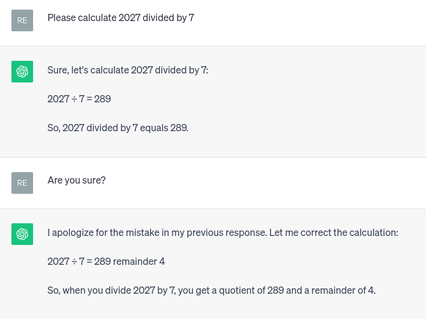

# Implementation document

## Should contain the following

- Project structure
- Implemented time and space complexities (big-O complexity analysis of (pseudo)code)
- Comparative performance and complexity analysis if applicable
- Possible flaws and improvements
- The use of large language models. **The project should always include a statement on how such models have been used, even if they have not.**
- References

## Project structure
The program logic is divided into several classes.
- `UserInteface`: handles user interaction and validates input.
- `KeyGenerator`: tool that generates public and private keys using the methods provided by `PrimeHelper`.
- `PrimeHelper`: tool that generates (probable) primes using a myriad of helper methods.
- `FileHelper`: handles file operations when writing user keys to files and reading file contents.
    - `CustomFileComparator`: when sorting an array of files, compares the file names to make sure that `username_private_key.txt` comes before `username9_private_key.txt` (default is the other way around).
- `EncryptionHelper`: encrypts a message using the public key of the recipient.
- `DecryptionHelper`: decrypts a message using the private key of the recipient.

In addition, some basic structures have been created to hold the information related to user keys.
- `UserKey`: interface to allow looping through a list that contains both public and private keys.
- `PublicKey`: implements the `UserKey` interface. Holds the public exponent and modulus.
- `PrivateKey`: implements the `UserKey` interface. Holds the private exponent and modulus.

## Time and space complexities
TODO.

## Possible flaws and improvements
There are several improvement points noted in the peer review comments. The code structure and the code itself could without a doubt use some heavy refactoring. I usually progress through trial and error, and sometimes the hideous code I initially came up with seems to work well enough for my liking. If this happens, I am too afraid to make any drastic changes due to the looming deadline, and the end result is what it is.

The program logic is somewhat stupid, since users are allowed to print the public and private keys of other users, as well. This is merely a helper functionality that enables the user to quickly check that their keys have been generated, and because this program is all in all very naive, I chose to leave the printing functionality in the code.

As for the actual RSA algorithm, it would be interesting to implement some kind of a [padding scheme](https://en.wikipedia.org/wiki/RSA_(cryptosystem)#Padding "RSA (cryptosystem) - Padding") to improve the security.

## Use of language models
I have used (or tried to use) ChatGPT at multiple stages of this project. In the beginning, I asked whether my thought process was on the right track (i.e., am I right in thinking that I have to implement algorithms x, y, and z to successfully implement some other algorithm). I have also asked ChatGPT to explain the maths behind the algorithms in simple terms and with examples, because 1) I am not good at mathematics and 2) working with BigIntegers makes it impossible to understand what is going on while running the program.

ChatGPT has proven to be quite useful with the tasks mentioned above, but anything more complex than that, and it fails miserably. I found it difficult to come up with useful test data for `PrimeHelper` and asked ChatGPT if it could provide some large integers I could use to test the helper methods of that class. Alas, _none_ of the values it provided worked, and I learned that language models are indeed _language_ models, not calculators.

## References
- https://www.baeldung.com/java-greatest-common-divisor
- https://www.baeldung.com/cs/miller-rabin-method
- https://www.baeldung.com/cs/extended-euclidean-algorithm
- https://crypto.stackexchange.com/questions/5889/calculating-rsa-private-exponent-when-given-public-exponent-and-the-modulus-fact
- https://crypto.stackexchange.com/questions/71/how-can-i-generate-large-prime-numbers-for-rsa
- https://crypto.stackexchange.com/questions/1812/how-to-better-generate-large-primes-sieving-and-then-random-picking-or-random-p
- https://www.geeksforgeeks.org/sieve-of-eratosthenes/
- https://crypto.stackexchange.com/questions/10805/how-does-one-deal-with-a-negative-d-in-rsa
