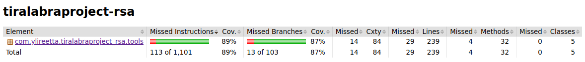

# Testing documentation
The test coverage of the project is 64 % in total. Automatic tests for `UserInterface`, `PublicKey` and `PrivateKey` in package `com.ylireetta.tiralabraproject_rsa` have not been implemented due to the nature of those classes, which affects the total coverage. The `com.ylireetta.tiralabraproject_rsa.tools` package coverage is 89 %.

## How to replicate test results
The automatic tests can be run by cloning the project, navigating to the project root directory (i.e., the directory where the pom.xml file resides), and running the command `mvn test`.

The test report can be generated to `target/site/jacoco/index.html` by running `mvn test jacoco:report` in the project root directory.

## What has been tested
Tests have been written for classes that contain some sort of program logic. `UserKey`, `PublicKey` and `PrivateKey` have not been tested, because they comprise of getters, setters, and `toString()` methods.

`PrimeHelper` tests verify that prime as well as composite numbers are detected successfully. The helper methods of the class are also tested. Some of the self-implemented methods are compared to the readily available methods of the `BigInteger` class.

The tests for the `FileHelper` class verify that files are created, written to, and read successfully. Also unsuccessful results are tested, e.g. by attempting to create multiple files of the same publicity class for the same user, and by attempting to read files that do not exist.

The `EncryptionHelper` and `DecryptionHelper` classes are tested by creating the test data (i.e., the encrypted message) by using the `modPow()` method of the `BigInteger` class. `EncryptionHelper` result is expected to equal the result of the `modPow()` operation. When testing `DecryptionHelper`, `modPow()` is called again using the private key components to create the expected result. The result from the `DecryptionHelper` is then expected to equal the result of the second `modPow()` operation.

The `KeyGenerator` class is tested by simply asserting that the keys are available after making the call to generate keys.