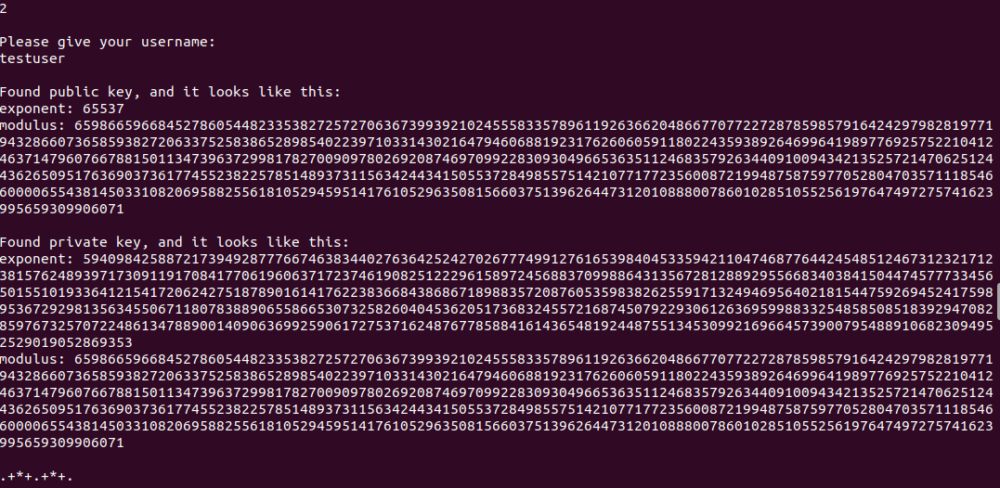

# User guide
The executable JAR can be found in LINK TO JAR.

If you have cloned the project yourself from Github, you can create the executable JAR yourself by running the following command in the project root directory:
```
mvn clean compile test package
```
Tests can be skipped by running
```
mvn clean compile package
```
The JAR can now be found in the `target` directory.

To execute the program, run the following command in the directory where the JAR is located:
```
java -jar tiralabraproject-rsa-1.0-SNAPSHOT.jar
```

## Features
There are four functionalities to choose from. The user can create a public and a private key for themselves, read the keys of a specific user, as well as encrypt or decrypt a message using the existing user keys. The command `x` ends the program.


### Generate keys
The user chooses the command `1` and presses enter. The program asks the user for their name and checks if it's valid (i.e., does not contain dots due to the file naming conventions) and available (i.e., if there already exists a key file with the provided name). If the name is free to use, public and private keys are generated and saved into text files in their respective directories. In case of successful key generation and file creation, the path to the key file directories is printed on the command line. If the username is already taken, the program infroms the user of this, and the user is returned to the main menu.


### Read keys
The user chooses the command `2` and presses enter. The program asks the user for their name and checks if key files for the provided username exist. If files are found, both the public and private keys are read from the files and printed on the command line. If no key files exist for the provided username, the program informs the user of this, and the user is returned to the main menu.




### Encrypt a message
The user chooses the command `3` and presses enter. The program asks the user for the username of the *message recipient*, as well as the message that should be encrypted. If a public key file for the given username is not found, the key files are generated on the fly and the new public key is used for encryption right away. If key files already exist, the public key file contents are used for encryption. The encryption end result is printed on the command line and copied to the clipboard for further use.


### Decrypt a message
The user chooses the command `4` and presses enter. The program asks the user for *their* name, as well as the message that should be decrypted. The message should contain only numbers at this point. If there are other characters present, the input is invalid and the user is informed of this. If the message is valid, the private key of the user is retrieved and used to decrypt the message. The result is printed on the command line.


